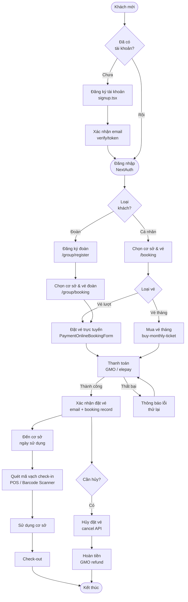

# Flow 1 — Hành trình khách hàng toàn cảnh

Toàn bộ vòng đời từ khi khách hàng lần đầu tiếp cận đến khi hoàn tất sử dụng cơ sở.

```mermaid
flowchart TD
    A([Khách mới]) --> B{Đã có\ntài khoản?}
    B -- Chưa --> C[Đăng ký tài khoản\nsignup.tsx]
    C --> D[Xác nhận email\nverify/token]
    D --> E([Đăng nhập\nNextAuth])
    B -- Rồi --> E

    E --> F{Loại\nkhách?}
    F -- Cá nhân --> G[Chọn cơ sở & vé\n/booking]
    F -- Đoàn --> H[Đăng ký đoàn\n/group/register]
    H --> H2[Chọn cơ sở & vé đoàn\n/group/booking]

    G --> I{Loại vé}
    I -- Vé lượt --> J[Đặt vé trực tuyến\nPaymentOnlineBookingForm]
    I -- Vé tháng --> K[Mua vé tháng\nbuy-monthly-ticket]
    H2 --> J

    J --> L[Thanh toán\nGMO / elepay]
    K --> L
    L -- Thành công --> M[Xác nhận đặt vé\nemail + booking record]
    L -- Thất bại --> N[Thông báo lỗi\nthử lại]
    N --> L

    M --> O[Đến cơ sở\nngày sử dụng]
    O --> P[Quét mã vạch check-in\nPOS / Barcode Scanner]
    P --> Q[Sử dụng cơ sở]
    Q --> R[Check-out]
    R --> S([Kết thúc])

    M --> T{Cần hủy?}
    T -- Có --> U[Hủy đặt vé\ncancel API]
    U --> V[Hoàn tiền\nGMO refund]
    V --> S
```
