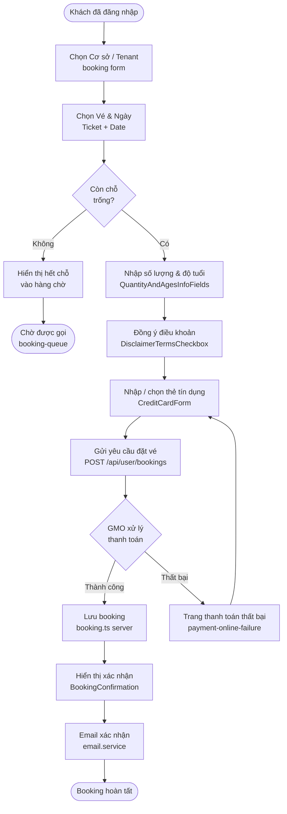

# Flow 3 — Đặt vé trực tuyến

Luồng chi tiết từ khi khách chọn cơ sở đến khi booking được xác nhận và email gửi đi.

```mermaid
flowchart TD
    A([Khách đã đăng nhập]) --> B[Chọn Cơ sở / Tenant\nbooking form]
    B --> C[Chọn Vé & Ngày\nTicket + Date]
    C --> D{Còn chỗ\ntrống?}
    D -- Không --> E[Hiển thị hết chỗ\nvào hàng chờ]
    E --> F([Chờ được gọi\nbooking-queue])
    D -- Có --> G[Nhập số lượng & độ tuổi\nQuantityAndAgesInfoFields]
    G --> H[Đồng ý điều khoản\nDisclaimerTermsCheckbox]
    H --> I[Nhập / chọn thẻ tín dụng\nCreditCardForm]
    I --> J[Gửi yêu cầu đặt vé\nPOST /api/user/bookings]
    J --> K{GMO xử lý\nthanh toán}
    K -- Thành công --> L[Lưu booking\nbooking.ts server]
    L --> M[Hiển thị xác nhận\nBookingConfirmation]
    M --> N[Email xác nhận\nemail.service]
    N --> O([Booking hoàn tất])
    K -- Thất bại --> P[Trang thanh toán thất bại\npayment-online-failure]
    P --> I
```
