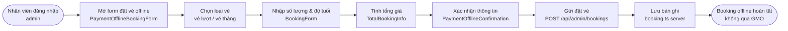

# Flow 4 — Đặt vé Offline (Admin / Nhân viên)

Dành cho nhân viên cơ sở tạo đặt vé hộ khách vãng lai, không qua thanh toán online GMO.

```mermaid
flowchart LR
    A([Nhân viên đăng nhập\nadmin]) --> B[Mở form đặt vé offline\nPaymentOfflineBookingForm]
    B --> C[Chọn loại vé\nvé lượt / vé tháng]
    C --> D[Nhập số lượng & độ tuổi\nBookingForm]
    D --> E[Tính tổng giá\nTotalBookingInfo]
    E --> F[Xác nhận thông tin\nPaymentOfflineConfirmation]
    F --> G[Gửi đặt vé\nPOST /api/admin/bookings]
    G --> H[Lưu bản ghi\nbooking.ts server]
    H --> I([Booking offline hoàn tất\nkhông qua GMO])
```
