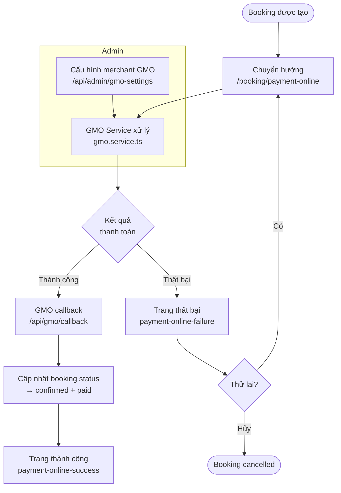

# Flow 5 — Thanh toán GMO

Chi tiết luồng xử lý thanh toán qua cổng GMO, bao gồm callback và trường hợp thất bại.

```mermaid
flowchart TD
    A([Booking được tạo]) --> B[Chuyển hướng\n/booking/payment-online]
    B --> C[GMO Service xử lý\ngmo.service.ts]
    C --> D{Kết quả\nthanh toán}
    D -- Thành công --> E[GMO callback\n/api/gmo/callback]
    E --> F[Cập nhật booking status\n→ confirmed + paid]
    F --> G[Trang thành công\npayment-online-success]
    D -- Thất bại --> H[Trang thất bại\npayment-online-failure]
    H --> I{Thử lại?}
    I -- Có --> B
    I -- Hủy --> J([Booking cancelled])

    subgraph Admin
      K[Cấu hình merchant GMO\n/api/admin/gmo-settings]
      K --> C
    end
```
