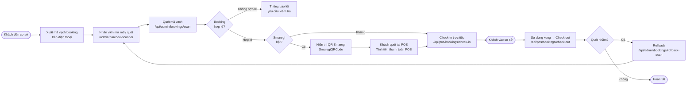

# Flow 6 — Check-in tại cơ sở

Luồng vận hành tại cơ sở: quét mã vạch, check-in/check-out, tích hợp POS Smaregi và rollback khi quét nhầm.

```mermaid
flowchart LR
    A([Khách đến cơ sở]) --> B[Xuất mã vạch booking\ntrên điện thoại]
    B --> C[Nhân viên mở máy quét\n/admin/barcode-scanner]
    C --> D[Quét mã vạch\n/api/admin/bookings/scan]
    D --> E{Booking\nhợp lệ?}
    E -- Không hợp lệ --> F[Thông báo lỗi\nyêu cầu kiểm tra]
    E -- Hợp lệ --> G{Smaregi\nbật?}
    G -- Có --> H[Hiển thị QR Smaregi\nSmaregiQRCode]
    H --> I[Khách quét tại POS\nTính tiền thanh toán POS]
    G -- Không --> J[Check-in trực tiếp\n/api/pos/bookings/check-in]
    I --> J
    J --> K([Khách vào cơ sở])
    K --> L[Sử dụng xong → Check-out\n/api/pos/bookings/check-out]
    L --> M{Quét nhầm?}
    M -- Có --> N[Rollback\n/api/admin/bookings/rollback-scan]
    N --> C
    M -- Không --> O([Hoàn tất])
```
