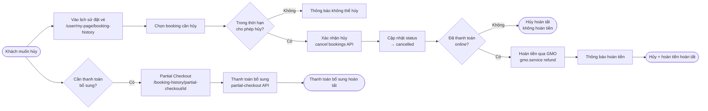

# Flow 7 — Hủy vé & Hoàn tiền

Luồng khách hủy đặt vé, hoàn tiền qua GMO, và thanh toán bổ sung (partial checkout).

```mermaid
flowchart LR
    A([Khách muốn hủy]) --> B[Vào lịch sử đặt vé\n/user/my-page/booking-history]
    B --> C[Chọn booking cần hủy]
    C --> D{Trong thời hạn\ncho phép hủy?}
    D -- Không --> E[Thông báo không thể hủy]
    D -- Có --> F[Xác nhận hủy\ncancel bookings API]
    F --> G[Cập nhật status\n→ cancelled]
    G --> H{Đã thanh toán\nonline?}
    H -- Không --> I([Hủy hoàn tất\nkhông hoàn tiền])
    H -- Có --> J[Hoàn tiền qua GMO\ngmo.service refund]
    J --> K[Thông báo hoàn tiền]
    K --> L([Hủy + hoàn tiền hoàn tất])

    A --> M{Cần thanh toán\nbổ sung?}
    M -- Có --> N[Partial Checkout\n/booking-history/partial-checkout/id]
    N --> O[Thanh toán bổ sung\npartial-checkout API]
    O --> P([Thanh toán bổ sung hoàn tất])
```
