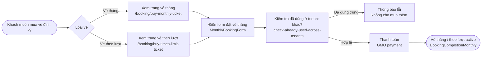

# Flow 8 — Vé tháng / Vé theo lượt

Luồng mua gói vé định kỳ cho phép đặt chỗ nhiều lần theo giới hạn sử dụng.

```mermaid
flowchart LR
    A([Khách muốn mua vé định kỳ]) --> B{Loại vé}
    B -- Vé tháng --> C[Xem trang vé tháng\n/booking/buy-monthly-ticket]
    B -- Vé theo lượt --> D[Xem trang vé theo lượt\n/booking/buy-times-limit-ticket]
    C --> E[Điền form đặt vé tháng\nMonthlyBookingForm]
    D --> E
    E --> F[Kiểm tra đã dùng ở tenant khác?\ncheck-already-used-across-tenants]
    F -- Đã dùng trùng --> G[Thông báo lỗi\nkhông cho mua thêm]
    F -- Hợp lệ --> H[Thanh toán\nGMO payment]
    H --> I([Vé tháng / theo lượt active\nBookingCompletionMonthly])
```
