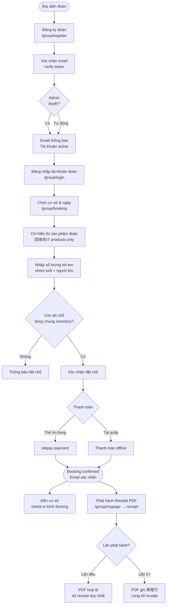

# Flow 10 — Đặt chỗ theo Đoàn *(Feature mới — ETA_02)*

Luồng đăng ký đoàn, đặt chỗ trên trang riêng chỉ hiển thị sản phẩm đoàn, thanh toán và phát hành receipt PDF.

```mermaid
flowchart TD
    A([Đại diện đoàn]) --> B[Đăng ký đoàn\n/group/register]
    B --> C[Xác nhận email\nverify token]
    C --> D{Admin\nduyệt?}
    D -- Có --> E[Email thông báo\nTài khoản active]
    D -- Tự động --> E
    E --> F[Đăng nhập tài khoản đoàn\n/group/login]
    F --> G[Chọn cơ sở & ngày\n/group/booking]
    G --> H[Chỉ hiển thị sản phẩm đoàn\n団体向け products only]
    H --> I[Nhập số lượng trẻ em\nnhóm tuổi + người lớn]
    I --> J{Còn đủ chỗ\ndùng chung inventory?}
    J -- Không --> K[Thông báo hết chỗ]
    J -- Có --> L[Xác nhận đặt chỗ]
    L --> M{Thanh toán}
    M -- Thẻ tín dụng --> N[elepay payment]
    M -- Tại quầy --> O[Thanh toán offline]
    N --> P([Booking confirmed\nEmail xác nhận])
    O --> P
    P --> Q[Đến cơ sở\ncheck-in bình thường]
    P --> R[Phát hành Receipt PDF\n/group/mypage → receipt]
    R --> S{Lần phát hành?}
    S -- Lần đầu --> T[PDF hợp lệ\nsố receipt duy nhất]
    S -- Lần 2+ --> U[PDF ghi 再発行\ncùng số receipt]
```
