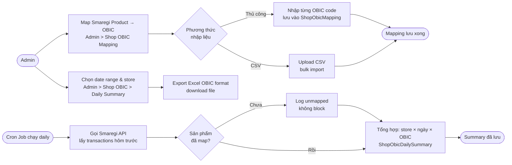

# Flow 11 — OBIC Shop Smaregi *(Feature mới — ETA_01)*

Luồng admin map OBIC code cho sản phẩm Smaregi, cron job tổng hợp daily và xuất Excel nộp OBIC.

```mermaid
flowchart LR
    A([Admin]) --> B[Map Smaregi Product → OBIC\nAdmin > Shop OBIC Mapping]
    B --> C{Phương thức\nnhập liệu}
    C -- Thủ công --> D[Nhập từng OBIC code\nlưu vào ShopObicMapping]
    C -- CSV --> E[Upload CSV\nbulk import]
    D --> F([Mapping lưu xong])
    E --> F

    G([Cron Job chạy daily]) --> H[Gọi Smaregi API\nlấy transactions hôm trước]
    H --> I{Sản phẩm\nđã map?}
    I -- Chưa --> J[Log unmapped\nkhông block]
    I -- Rồi --> K[Tổng hợp: store × ngày × OBIC\nShopObicDailySummary]
    J --> K
    K --> L([Summary đã lưu])

    A --> M[Chọn date range & store\nAdmin > Shop OBIC > Daily Summary]
    M --> N[Export Excel OBIC format\ndownload file]
```
